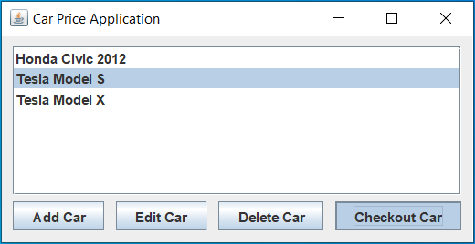
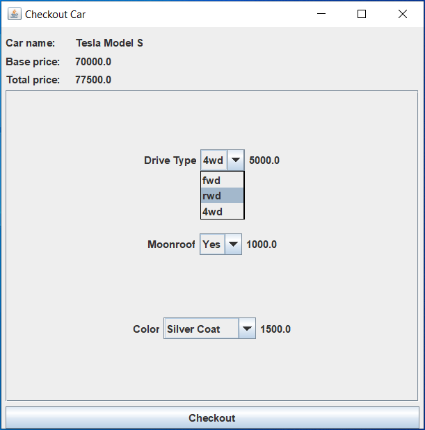
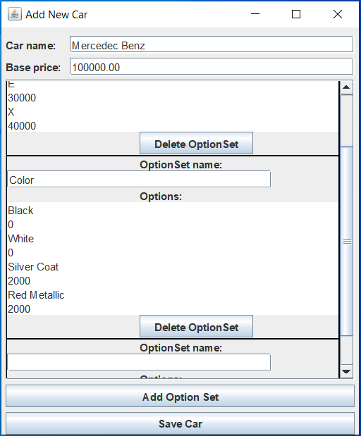
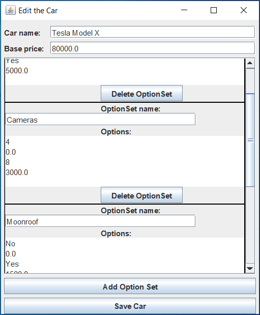
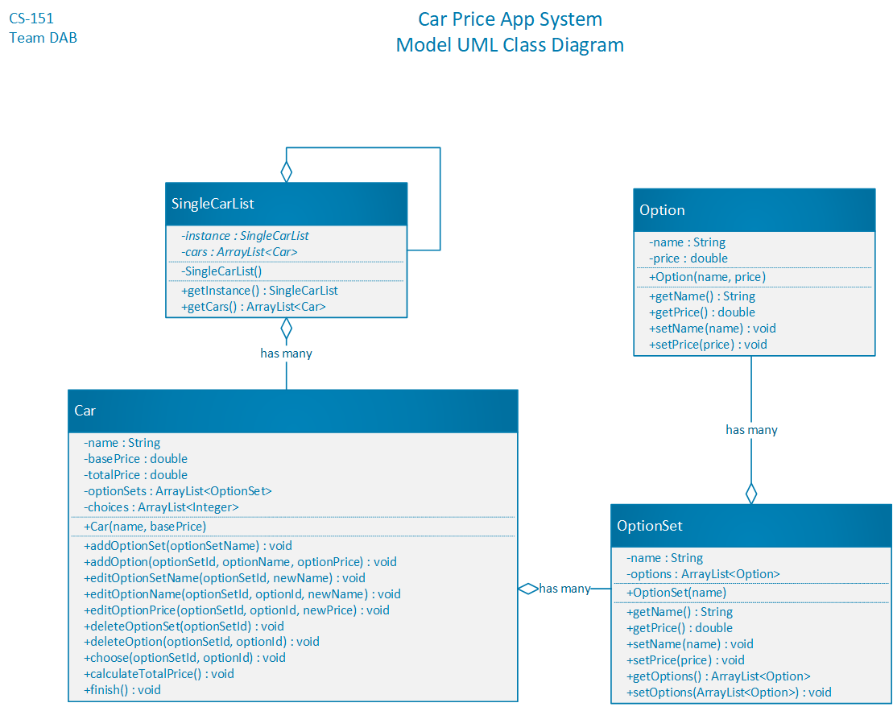

# CarPrice

>Java Swing MVC application that allows users to check out car prices and modify them.  Essentially, it is a kbb.com (Kelly Blue Book) prototype.

To run the application, double click the **CarPrice.jar** file in the project folder.

Cars are saved in a serialized file. If the file gets deleted, the software "heals" itself and recreates the file with some initial test cars.

## Application's Screenshots

###Main Screen

###Checking Out the Existing Car

###Adding a New Car

###Editing the Existing Car

## Model Design

Model uses the Singleton pattern, in which the car list is wrapped in a SingleCarList class that is shared across the application.  
Model, View, and Controller classes are strictly separated, following the MVC pattern.

## Project's Origins

This application was made as a semester team project for SJSU.  
The collaborators:  
  - Ahror Abdulhamidov - team leader (Me)  
  - Dickson Minang  
  - Basmah Altimimi  
